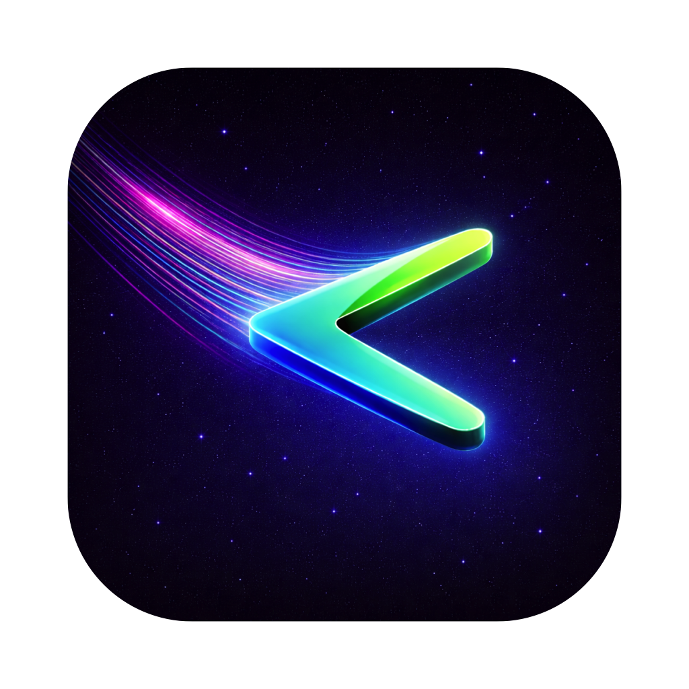
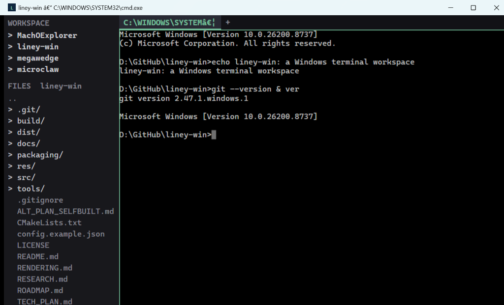
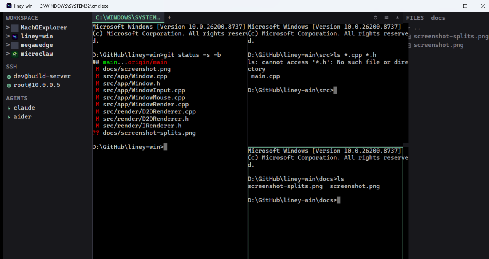

<div align="center">



# liney-win

**Windows 上的「终端工作区」** —— 把仓库、worktree、分屏、标签放进同一个窗口。

对标 macOS 的 [liney](https://github.com/everettjf/liney)。终端核心是 Ghostty 的
**[libghostty-vt](https://github.com/ghostty-org/ghostty)**;UI 全自绘 **Win32 /
Direct2D**。用 **MSVC + Zig** 构建。

[](https://github.com/everettjf/liney-win/releases)
[](https://github.com/everettjf/liney-win/releases)


[](LICENSE)

[English](README.md) · **中文**

</div>



---

## 为什么是 liney-win？

普通终端给你标签页，**liney-win 给你一个工作区。** git 仓库与它们的 worktree 就在
侧边栏里，每个项目有自己的图标，文件树跟随你正在输入的那个 pane，整套分屏布局会原样
恢复。这是 Windows 一直没有的「多仓库、多 pane」驾驶舱 —— 全部从零自绘，所以启动极快、
除了系统本身不依赖任何东西。

## ✨ 功能

**🖥️ 终端** —— 由 **Ghostty 的 libghostty-vt** 核心驱动
- 完整 VT 解析:光标 / 擦除 / 滚动区 / 插入删除,SGR 16/256/truecolor,实际渲染
  **粗体/斜体/下划线/反显/弱化/删除线**,UTF-8,**宽字符(中日韩)整字形绘制**,grapheme 簇
- **scrollback 历史**(滚轮 · `Shift+PgUp`),改窗口大小时长行**重排(reflow)**
- **备用屏 alt-screen** —— vim / less / `git log` 等全屏程序正常工作,且**滚轮直接
  滚动它们**(备用屏激活时滚轮转为方向键)
- **光标** —— DECSCUSR **方块 / 竖线 / 下划线** 三种形状(vim 换模式即换形状)、
  按终端模式**闪烁**、pane 失焦变空心、支持 OSC 12 光标颜色
- **鼠标上报** —— vim(`:set mouse=a`)/ htop / mc 能收到点击、拖动和滚轮
  (SGR + 传统协议);按住 **Shift** 则回到本地文本选择
- OSC 驱动的**窗口标题**与 **cwd 跟踪**(文件树跟随 shell 当前目录)
- **选择 + 复制粘贴** —— **选区锚定在文本上**(滚动、新输出涌入时高亮跟着内容走)、
  拖动选择、**双击选词 / 三击选行**(中日韩友好)、**选中即复制**(可选)、右键菜单、
  `Ctrl+V` / `Shift+Insert` 粘贴、bracketed paste、**多行粘贴确认**(可关);
  **IME**(中日韩)候选窗口跟随光标
- **查找**(`Ctrl+F`)—— 高亮所有可见匹配,并**搜索整个 scrollback**:
  `Enter`/`F3` 逐个向上跳到历史里的匹配,`Shift+Enter` 往回走
- **字体** —— 在**设置**里选任意等宽字体和字号,或 `Ctrl +/-/0` / **`Ctrl+滚轮`**
  缩放,字体与字号都跨次启动记忆
- **主题** —— **7 套内置预设**(Emerald / Azure / Violet Night、Amber Dark、
  Rose Dark、Slate Frost、Paper Light)、可实时切换的主题下拉,以及**自定义强调色**
  (活动 pane 分隔线 / 活动标签的颜色);高级用户还可覆盖前景/背景 + 16 色 ANSI 调色板
- **Unix 命令** —— 装了 Git for Windows 后,`ls` / `cat` / `grep` / `rm` / `sed` /
  `awk` / … 在任意 shell 都能用

**🗂️ 工作区** —— liney 的差异化
- 标签(带 **× 关闭按钮**,右键可 **关闭右侧 / 左侧 / 其他 / 全部标签**)+ 二叉
  **分屏**(拖分隔条调比例、拖标签重排),`Alt+方向键` 切焦点
- **Pane 缩放**(`Ctrl+Shift+Z`)把当前 pane 最大化;**Equalize**(`Ctrl+Shift+E`)
  平均分布 —— 分屏再多也不至于看不清
- **仓库**侧边栏,带**每项目图标**,可展开到 **worktree**
- **项目管理**:WORKSPACE 的 **+** 添加项目文件夹;右键项目可 **新建 worktree… /
  设置图标… / 从工作区移除**(持久化到配置)
- 右侧**文件树**跟随聚焦 pane
- **SSH** 主机与 **agent** 会话,各有图标,一键打开
- **布局持久化** —— 标签 + 分屏树 + 各 pane 的 cwd,下次启动恢复

**⚡ 内置工具**
- 右上角 **☰ 菜单**:设置 · 定时关机 · 命令历史 · 检查更新 · 支持与诊断二级菜单
- **设置对话框** —— 点点即可配置 shell、字体与字号、主题与强调色、scrollback、
  工作区根目录、选中即复制、粘贴确认、Unix 工具;即时生效并保存(不会动手工编辑的其他键)
- **防止电脑睡眠**(`Ctrl+Shift+K`)—— 长任务时阻止系统/显示器休眠,可选
  **1 / 2 / 3 / 6 / 24 小时或一直开着**,菜单里显示剩余时间
- **定时关机** —— 可选择 **1 / 2 / 3 / 6 / 12 / 24 小时**后关机，也可从同一菜单取消
- **Git**:`Ctrl+Shift+L/G` 在新标签开 `git log` / `git diff`
- **通知**:`liney notify` CLI + OSC `9`/`777` → Windows 托盘通知
- session 启停 / app 退出的**生命周期 hooks**
- 从 GitHub release **自动更新**(`Ctrl+Shift+U`)

## 📸 截图

| 工作区 + 侧边栏 | 分屏 |
|---|---|
|  |  |

## 📦 安装

**下载** —— 到 [Releases](https://github.com/everettjf/liney-win/releases) 页:

| 文件 | 说明 |
|---|---|
| `liney-win-setup.exe` | 安装包 —— 每用户安装,免管理员,带开始菜单 + 卸载 |
| `liney-win-portable.zip` | 便携版 —— 解压双击 `Liney.exe` |

**支持系统：** 64 位 Windows 10 1809 或更高版本，以及 Windows 11。安装包和
便携包均自带所需的 MSVC Runtime DLL，无需用户另行安装 VC++ 运行库。

**从源码构建** —— Windows 10 1809+/11,需要:
- **Visual Studio 2022** Desktop C++(自带 CMake ≥ 3.20 + Ninja)
- PATH 上有 **[Zig 0.15.2](https://ziglang.org/download/)** —— 终端核心从 Ghostty 经 Zig 构建

```powershell
# 在 “x64 Native Tools Command Prompt for VS 2022” 中,且 zig 在 PATH 上
powershell -ExecutionPolicy Bypass -File tools\build.ps1
.\build\Liney.exe
```

`tools\build.ps1` 会配置 + 构建,并把 Zig 缓存指到构建所在盘符(Zig 0.15.2 的一个怪癖:
源码与缓存在不同盘符时构建会 panic)。首次构建会拉取 Ghostty 并编译 `libghostty-vt`,
耗时较长;`ghostty-vt.dll` 会自动拷到 exe 旁边。

> 想用原始 CMake?`cmake -B build -G Ninja -DCMAKE_BUILD_TYPE=Release && cmake --build build`
> —— 但先把 `ZIG_GLOBAL_CACHE_DIR` 设到构建所在盘符的目录。

## ⌨️ 快捷键

| 键 | 作用 |
|---|---|
| `Ctrl+Shift+T` / `Ctrl+Shift+W` | 新建标签 / 关闭当前 pane |
| `Alt+D` / `Shift+Alt+D` | 左右分屏(并排) / 上下分屏(堆叠) |
| `Ctrl+Tab` / `Ctrl+Shift+Tab` | 下一个 / 上一个标签 |
| `Ctrl+1`…`Ctrl+8` / `Ctrl+9` | 跳到第 N 个 / 最后一个标签 |
| `Alt+方向键` | 在分屏 pane 间移动焦点 |
| `Ctrl+Shift+B` / `Ctrl+Shift+F` | 切换左侧边栏 / 右侧文件面板 |
| `Ctrl+Shift+C` / `Ctrl+Shift+V` | 复制选区 / 粘贴 |
| `Ctrl+C` / `Ctrl+V` | 有选区时复制(否则发 ^C)/ 粘贴 |
| `Shift+Insert` / `Ctrl+Insert` | 粘贴 / 复制选区 |
| `Ctrl+Shift+A` | 全选(含 scrollback) |
| `Ctrl+F` · `Enter`/`F3` · `Shift+Enter` · `Esc` | 查找 · 向上跳匹配(搜整个历史)· 向下 · 关闭 |
| `Shift`+点击/拖动 | 应用占用鼠标(vim/htop)时仍做本地选择 |
| `Ctrl++` / `Ctrl+-` / `Ctrl+0` · `Ctrl+滚轮` | 放大 / 缩小 / 重置字号 · 缩放 |
| `Ctrl+Shift+L` / `Ctrl+Shift+G` | 当前仓库的 `git log` / `git diff` |
| `Ctrl+Shift+K` | 防睡眠(阻止休眠)开 / 关 |
| `Ctrl+Shift+U` | 检查并安装更新 |
| 滚轮 · `Shift+PgUp/PgDn/Home/End` | 在 scrollback 历史中滚动 |
| 鼠标 | 切标签 · 聚焦 pane · 展开仓库 · 开 worktree/SSH/agent · 拖动选择(越界自动滚动)· 双击/三击选词/选行 · pane 内右键复制/粘贴/查找 · 拖动调比例 / 重排 · 右键管理 worktree |

## ⚙️ 配置

首次运行写入 `%USERPROFILE%\.liney\config.json`(对应 macOS liney 的 `~/.liney/`;
完整示例见 [`config.example.json`](config.example.json)):

```json
{
  "shell": "cmd.exe",
  "fontFamily": "Cascadia Mono",
  "fontSize": 16,
  "scrollback": 10000,
  "workspaceRoot": "",
  "unixTools": true,
  "copyOnSelect": false,
  "hooks": { "sessionStart": "", "sessionExit": "", "appExit": "" },
  "sshHosts": ["user@host"],
  "agents": [{ "name": "agent", "command": "claude", "cwd": "" }],
  "projectIcons": { "my-repo": "C:\\path\\to\\icon.png" },
  "theme": { "background": "#102840", "foreground": "#e8e8d0", "palette": ["#000000", "..."] }
}
```

| 字段 | 含义 |
|---|---|
| `shell` | 新标签的 shell(`powershell.exe` / `pwsh.exe` / `wsl.exe`;`wsl tmux` 跑 tmux) |
| `workspaceRoot` | 侧边栏扫描根目录；留空则不自动扫描，只显示手动添加的项目 |
| `keybindings` | 操作名到快捷键（如 `Ctrl+Shift+P`）的映射；重复快捷键会提示并忽略 |
| `unixTools` | 把 Git 的 `usr\bin` 加进 PATH,使 `ls`/`cat`/`grep`/… 可用 |
| `copyOnSelect` | 选择结束即复制到剪贴板(PuTTY 风格) |
| `fontSize` | 终端字号;`Ctrl +/-/0` 与 `Ctrl+滚轮` 会更新并记忆 |
| `scrollback` | 每个会话保留的历史行数(默认 10000) |
| `sshHosts` / `agents` | 侧边栏 SSH / AGENTS 区的入口 |
| `projectIcons` | 每个仓库的侧边栏图标(否则用仓库自带的 `icon.png`/`logo.png`) |
| `theme` | 终端前景/背景 + 16 色 ANSI 调色板 |
| `hooks` | session 启停 / app 退出执行的命令 |

布局写入 `%USERPROFILE%\.liney\layout.json`,下次启动自动恢复。

## 🔔 `liney` CLI 与通知

随主程序构建内置 CLI(即 `Liney.exe` 本身),在 pane 内运行即可通过 OSC 驱动终端(对标 macOS
liney 的 `liney notify`):

```
liney notify <body>            # 弹 Windows 托盘通知
liney notify <title> <body>
liney title  <text>            # 设置标签/窗口标题
```

把安装目录加入 PATH 后,长任务结束 `liney notify "done"` 即可提醒。终端也解析
OSC `0/2`(标题)、`7`(cwd)、`9` 与 `777;notify`(通知)。

## 🏗️ 架构

```
键盘/鼠标 → Window(工作区编排) → 路由到聚焦 pane
            ↑ 合成 sidebar · 标签栏 · 分屏树 · 文件面板 · 工具栏
TerminalSession = Terminal + ConPty + Grid
   ConPty      —— Windows 伪控制台(起 shell、读/写、resize)
   Terminal    —— 封装 libghostty-vt(Ghostty 的 VT 引擎):PTY 字节 → 渲染快照 → Grid
   D2DRenderer —— Direct2D/DirectWrite 把 Grid + chrome 画到窗口
```

源码导览见 [`src/`](src);技术选型与调研见 [`RESEARCH.md`](RESEARCH.md) /
[`ALT_PLAN_SELFBUILT.md`](ALT_PLAN_SELFBUILT.md) /
[`TERMINAL_LANDSCAPE.md`](TERMINAL_LANDSCAPE.md);渲染计划见 [`RENDERING.md`](RENDERING.md)。

## 🗺️ 路线图

已完成与待办(含与 macOS liney 的对照)见 [`ROADMAP.md`](ROADMAP.md)。仍待后续:
鼠标上报(受 ConPTY 限制)、SFTP 远程文件树、glyph atlas 渲染、原生 tmux control-mode。

## 🤝 贡献

欢迎 Issue 与 PR —— 完整环境搭建见 [`CONTRIBUTING.md`](CONTRIBUTING.md)。最关键的一点:
构建 libghostty-vt 内核需要 **Zig 0.15.2**(不是 0.16.x)。代码是纯 C++20 + Win32 +
Direct2D,已拆成小而内聚的文件(见 [`src/`](src)),新增代码请与周围风格保持一致。

## 🙏 致谢

- [liney](https://github.com/everettjf/liney) by [@everettjf](https://github.com/everettjf) —— 本项目对标的 macOS 原版,也是应用图标的来源。
- [Ghostty](https://github.com/ghostty-org/ghostty) —— 提供 `libghostty-vt`,liney-win 的终端核心(经 Zig 从 Ghostty 构建)。

## 📄 许可

[Apache-2.0](LICENSE) —— 与 liney 相同。
